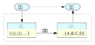
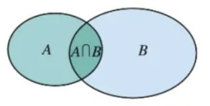
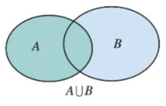
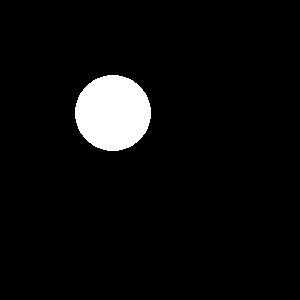
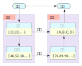
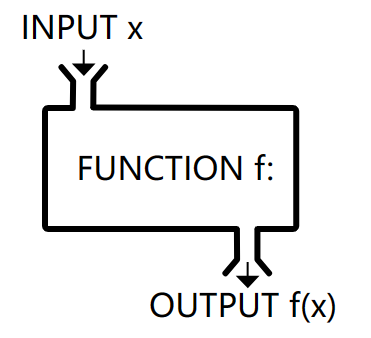

[TOC]

# 序言

> "对, 要学习的东西太多了." 米洛若有所思的皱起了眉.
>
> "没错." 韵律公主说: "但是, 光学习是不够的, 关键的是: 你要知道学这些有什么用, 以及为什么要学这些东西."
>
> 
--- 摘录自《神奇的收费亭》

>
> _~Aq!~_

> [!TIP]
>
> ==这是一本倡导自主学习的高等数学讲义.==
>
> 
>
> 做同样的一件事, 带着目标去做和不带目标去做的效果是完全不同的. 打个比方, 有两个人各自要砍100棵树, 第一个人不知道为什么要砍这么多的树. 而另一个人知道这些树是为他来盖房子的. 可以想象, 同样在砍树, 这两个人内心的感受是不同的, 完成的效果也是不一样的: 第一个人也许会砍一些松软有蛀虫的 easy 树充数, 而第二个人则会主动去砍粗壮硬实的 hard 树, 因为这是为他自己的房子. 我们称前者为**被迫砍树**, 后者为**自主砍树**.
>
> 
>
> 跟砍树一样, 学习也可以分为**被迫学习**和**自主学习**. 本讲义的**设计理念**是**帮助大学生更好的自主学习**. 我们可以把高数学习看成是为自己盖房子, 盖房子当然要砍树(做习题), 但我会先把房子的**设计图纸**给大家看, 在介绍每个数学概念时, 首先让大家明白这些部分是为了造窗, 那些部分是为了造门. 当我们明白了所学内容在整个知识体系中的**目的和意义**, 自然就会有大局观, 有参与感, 从而把**被迫砍树**变为**主动砍树**, 把**被迫学习**变为**主动学习**.
>
> 
>
> **总之, 希望每个同学都把高数学习当成是一场辛苦却有意义的旅程, 你的世界观也将因这次旅程而变得更加深刻和丰满**.

> [!Important]
>
> ==如何才能做到自主学习?==
>
> 
>
> 长期以来我们的数学教学往往对 **`Why`** 强调得不够: **为什么要学?** 更多的时候我们是在强调 **`What`** 和 **`How`**: 先介绍某某定理, 然后做习题. 这就像只让我们去砍树, 而不告诉我们砍树是为了什么. 中学时代为了练基本功这样做也无可厚非, 但在注重知识体系, 强调自主探索的大学时代, 再这样做就不合时宜了. 
>
> 
>
> 自主学习的关键是要告诉学生**为什么要学**, 不能只是空洞的说数学很重要, 而应该是首先把数学知识体系的设计图纸展示给大家, 让大家明白`为什么`要去学某个知识点, 以及这个知识点`有什么用`.
>
> 
>
> **`高等数学`**的主要内容是**`微积分`**. 微积分是一个强大的数学工具. **牛顿**借助微积分成功解释了行星运动, 这是人类文明历史上浓墨重彩的一笔. 本教材将会围绕**运用微积分解释行星运行规律**这一主线进行展开, 我们所学的知识点都能够顺着这条主线串起来. 尽管有些内容会包含一些繁琐的推演和计算, 但我相信我们每个人潜意识里对真理的渴望能够克服这些困难, 最后让我么不得不感慨微积分的强大力量.

> [!caution]
>
> ---
> 
> > ==如何学好高数==
> > 
> > **数学直觉**的培养和建立.
> > 
> > <iframe src="https://player.bilibili.com/player.html?isOutside=true&aid=1355578989&bvid=BV1jz421b7p4&cid=1574534749&page=1&autoplay=false" scrolling="no" border="0" frameborder="no" framespacing="0" allowfullscreen="true" width="85%" height="400"></iframe>
>
> > ==如何使用本讲义==
> > 
> > 本讲义的特点:
> > 
> > - 使用HTML5技术, 注重视觉上的舒适性. 
> > - 可在电脑, pad和手机端观看, 带有夜晚模式, **对手机用户友好**.
> > - 手机端可以安装本讲义的APP版本.
> > 
> > 为了便于阅读, 在讲解每个知识点时, 我们大致会按照下面的顺序:
> > 
> > - **`Why`**: 为什么要学它?
> > 
> > - **`What`**: 它是什么? 
> > 
> > - **`How`**: 怎么算或怎么用?
> > 
> > - **`Exercise`**: 相关例题
> > 
> > - **`Extension`**: 背景知识或小故事
> > 
> > 这五个模块我们会用不同的颜色标记.
> 

> [!Note]
>
> ---
> > ==人工智能与高等数学==
> > 
> > 人工智能的核心数学基础包括**线性代数**, **微积分**和**概率论**. 线性代数是骨架, 微积分是肌肉, 概率论是灵魂.
> 
> > ==编程与高等数学==
> > 
> > 数学对于计算机编程的重要性不言而喻, 本课程的授课对象为计算机专业本科一年级学生, 因此我们在设计讲义的时候会更多的建议数学与编程的联系. 

> [!warning]
>
> ---
> 
> > ==关于考试==
> > 
> > - 平时成绩20%: 作业
> > 
> > - 期中考试30%: 闭卷
> > 
> > - 期末考试50%: 闭卷
> > 
> > **无考勤, 考试本身保证公平性, 但是课堂上讲的内容会对考试有帮助.**
>
> > ==致谢:==
> > 
> > - 首都师范大学数学科学学院
> > - 首都师范大学交叉科学研究院
> > - 北京国家应用数学中心
> > - Typora
> > - Vlook
>
>
>
> ---
>
>
>
> ==参考书目:==
>
> - 《高等数学》(第七版)上册， 同济大学数学教研组主编，高等教育出版社.
>

# 集合与映射

> [!TIP]
>
> ==集合与映射是数学研究从具体到抽象的第一步.==
>
> 举个例子, 比如我们上这门高数课, 最后需要给每个上课的学生一个成绩, 这是我们的具体任务. 为了从数学上来更加严格的描述这个任务, 我们可以把所有选课的同学构造成一个**集合** $S$, 同时把所有可能的成绩 (比如A, B, C, D四个档次) 构造成另一个**集合** $G$, 那么给学生成绩的这个任务在数学上就可以看成是**从集合 $S$ 到集合 $G$ 的一个映射**. 这个映射具体怎么实现是有讲究的, 而通过数学的办法可以让这个映射变得更方便, 更直观, 也更公平, 这个我们后面再展开.
> 
> 
>

## 集合
### 集合的概念

> [!TIP]
> 
> 当我们用**数学语言**来描述世界时, 首先要把我们**感兴趣的对象**给拿出来, 进行适当的抽象, 然后再研究它们的规律. **集合**就是数学中用来界定对象的一个概念.
> 

> [!Note]
> 
> ==集合举例==
>
> 1. *`太阳系八大行星`* --- $\{水星, 金星, 地球, 火星, 木星, 土星, 天王星, 海王星\}$
> 2. *`10个阿拉伯数字`* --- $\{0, 1, 2, 3, 4, 5, 6, 7, 8, 9\}$
> 3. *`一个班所有男生的姓氏`* --- $\{李, 王, 张, 杨, 周, 诸葛, 徐, 孙, 胡\}$
> 4. *`1 ~ 10 之间的所有偶数`* $A=\left \{  2,4,6,8,10\right \} $
> 6. *`自然数集`* --- $\mathbb{N} = \left\{0, 1, 2, 3, \cdots \right\}$
> 7. *`整数集`* --- $\mathbb{Z} = \left\{0, \pm 1, \pm 2, \pm 3, \cdots \right\}$
> 8. *`实数集`*  --- $\mathbb{R} = \left\{x: -\infty < x < \infty \right\}$
> 9. *`满足不等式 $x-3<10$ 的所有实数 $x$`* --- $A=\left \{x < 7\right \} $

> [!Important]
>
> 我们把所要研究的对象统称为**元素** (element), 这些元素所组成的总体叫做**集合** (set). 
>
> 描述集合的方式既可以通过文字叙述, 也可以把所有的元素写在 $\{\}$ 里面, 不管用那种方式, 一定要让人能够判断某个对象是不是在这个集合里.
>
> 集合需要满足下面两个性质: 
>
> 1. **互异性**: 集合中的任何两个元素都是不同的.比如在集合3的例子中, 即使这个班里有3个同学姓“王”, 在集合3中“王”姓也只出现一次, 重复的不算.
>
> 2. **无序性**: 集合中的元素没有顺序之分. 所以集合 $\{水星, 金星, 地球\}$ 与集合 $\{地球, 水星, 金星\}$ 是没有区别的.
>

> [!Caution]
>
> 一般用大写字母如 $A, B, C$ 表示集合, 用小写字母如 $x$ 或 $a, b, c$ 来表示集合中的元素.
>
> 我们说一个对象**在**或**不在**一个集合中, 用数学术语就是**属于**或**不属于**: 
>
> - 如果 $x$ 是集合 $A$ 的元素, 就说 $x$ **属于** 集合 $A$ , 记作 $x\in A$ ; 
> - 如果 $x$ 不是集合 $A$ 中的元素, 就说 $x$ **不属于** 集合 $A$, 记作 $a \notin A$.

> [!Warning]
> 
> **图像掩码**是计算机视觉中的重要概念. 掩码 (mask) 通常是一个二值 (0或1) 图像, 像素值为0表示不关心的区域, 1表示感兴趣的区域. 因此所有像素值为1的像素点构成的集合就是我们感兴趣的区域 (ROI, Region of Interest). 比如下图中, 左侧是我们拿到的一张图片 , 我们只关心图片中花朵的区域, 因此对应的掩码就是中间的一个二值图像 (黑色区域的像素值为0, 白色区域的像素值为1), 将这个掩码逐像素的跟原图相乘, 得到的结果就是右边的这张只有花朵的图 (花朵部分的值跟原图一样, 花朵部分之外的值都等于0).
>
> 
> 

### 单个集合的性质

> [!TIP]
> 
> 集合是一个包罗万象, 不同的集合可能包含截然不同对象, 我们在研究集合的时候, 首先要搞清楚**集合内部元素的性质**.
> 

> [!important]
>
> ==有序性==
>
> 如果一个集合中的元素可以排序, 那么这个集合就是**有序集**, 否则就是**无序集**. 
>
> 注意这个并不是一个严格的数学定义, 即使在实际操作中也是模糊的, 比如集合 $\{红, 绿, 蓝\}$, 理解成三个汉字的话可能无法排序, 但理解成颜色所对应的波长则可以间接的通过波长大小进行排序. 所以关键的问题是, 你在建立这个集合时所关心的**具体问题**是什么. 我们在使用集合这个工具的时候一定要先想清楚这一点, 这很重要, 尤其是对于学习**编程**_~Rd~_的同学！例如, 在程序里, 有序集中的元素可以通过指标很方便的访问, 还可以使用 **QuickSort** 算法；而访问无序集中的元素则需要一个一个去比较, 也无法使用 QuickSort 算法！
>

> [!Note]
>
> ==有序性==
> 
> 有些集合中的元素之间是可以比较大小的, 如: 
>
> - 实数集 $\mathbb{R}$
> - 音阶集 $\{ 哆, 来, 咪, 发, 嗦, 啦, 西\}$
> 
> 也有些集合中的元素之间是不能比较大小的(至少并不明显), 如: 
>
> - 天气集 $\{ 天晴, 多云, 下雨, 雾霾\}$ 
> - 动物集 $\{ 猫, 狗\}$
> 

> [!Important]
> 
> ==等价关系==
> 
> 如果我们能够在一个集合上定义某种**等价关系**, 那么凡是“等价”的元素都可以划分到一个子集中, 而这些子集也被称为**等价类**. **等价关系**是集合元素间的一种二元关系, 以符号 $\sim$ 表示, 它满足以下三个条件: 
>
> 1. **自反性**: 对于所有 $a \in A$, 有 $a \sim a$.
> 2. **对称性**: 对于所有 $a, b \in A$, 如果 $a \sim b$, 则 $b \sim a$.
> 3. **传递性**: 对于所有 $a, b, c \in A$, 如果 $a \sim b$ 且 $b \sim c$, 则 $a \sim c$.

> [!Note]
>
> ==等价关系==
>
> - 整数集 $ℤ$ 模 2 的等价关系: 如果 $a, b$ 除 2 的余数相等则 $a$ 和 $b$ 等价. 在该等价关系下, 所有偶数 (除2余0) 构成了一个等价类, 所有奇数 (除2余1) 构成了另一个等价类.
> - 记某个班全体同学构成的集合为 $A$, 如果 $a, b$ 两位同学坐在同一列则 $a$ 和 $b$ 等价. 在该等价关系下, 每一列的同学构成一个等价类.

> [!Important]
> 
> ==一些常用的集合性质==
> 
> - 有限集 (有穷集) : 含有有限个元素的集合, 如 $\{ 2, 4, 5, 8\}$.
> - 无限集 (无穷集) : 含有无穷多个元素的集合, 如自然数集 $\mathbb{N}$.
> 
> **数集**中常用的性质还有
> 
> - 有界集: 集合中的所有元素 $x$ 的绝对值都小于 $M$, 如开区间 $(0, 1)$.
> - 无界集: 如 $(0, +\infty)$.

### 集合之间的关系

> [!TIP]
> 
> 集合 $A$ 和 $B$ 之间能不能进行比较?有没有大小关系?

> [!IMPORTANT]
>
> ==两个集合之间可以的包含关系==
>
> 如果集合 $A$ 中**任意**_~Rd~_一个元素都是集合 $B$ 中的元素, 则称 $A$ **包含于** $B$ (或 $B$ **包含**$A$), 记作 $A\subseteq B$ 或 $B\supseteq A$, 此时称 $A$ 为 $B$ 的 **子集** (subset). 
> 
> 基于集合的包含关系我们再引入两个概念: 
> 1. **空集**: 不包含任何元素的集合叫做 **空集** (emptyset), 记为 $\phi $, 空集是任何集合的子集.
> 2. **集合相等**: 如果 $A\subseteq B$, 同时 $B\subseteq A$, 则集合 $A$, $B$ 中的元素是完全一样的, 此时我们说集合 $A$ 等于集合 $B$, 记作$A=B$.

> [!Caution] 
> ==借助图像表示集合间的包含关系==
> 
> 集合 $A$ 包含于集合 $B$ 可以用下图表示
> 
>  

> [!Note]
> 
> ---
> 
> > 下面例子中的 $A$ 和 $B$ 存在包含关系:
> > 
> > 1. $A=\left\{ 1,2,3 \right\},$  $B=\left\{1,2,3,4,5\right\}.$
> > 
> > 2. $A$ 为一个班所有男生, $B$ 为该班所有学生.
> > 
> > 3. $A$ 为所有等腰三角形, $B$ 为所有三角形.
> 
> > 下面例子中的 $A$ 和 $B$ 不存在包含关系 (找反例):
> > 
> > 1. $A=\left\{ 1,2,6 \right\}$, $B=\left\{1,2,3,4,5\right\}$.
> > 
> > 2. $A$ 为一个班所有男生, $B$ 为该班所有女生.
> > 
> > 3. $A$ 为所有等腰三角形, $B$ 为锐角三角形.
>  

### 集合之间的运算

> [!TIP]
> 
> 集合 $A$ 和 $B$ 之间能不能做运算? *`加`* *`减`*法是没有的, 但是有*`交`* *`并`* *`补`*运算. 

> [!Important]
> 
> ==交集==
> 
> 所有既属于 $A$ 又属于 $B$ 的元素组成的集合称为 $A$ 与 $B$ 的 **交集** (intersection set), 记作 $A\cap B$ (读作“$A$ 交 $B$”), 即
> 
> $$
> A\cap B=\left \{ x: x\in A \ \mathrm{and} \ x\in B \right \}
> $$
> 
> 下图展示了交集运算: 
> 
> 

> [!Note]
> 1. $A=\left\{2, 4, 6, 8, 10 \right\}$, $B=\left\{ 3, 5, 8, 12 \right\}$,  则 $ A \cap B =\left\{ 8 \right\}$. 
> 2. $A=\left \{全校女同学 \right \} $, $B=\left \{所有高一级同学 \right \} $,  $A \cap B = \left \{ 高一级全体女同学 \right \}$.

> [!important]
> 
> ==并集==
>
> 所有属于集合 $A$ 或属于集合 $B$ 的元素组成的集合, 称为集合 $A$ 与 $B$ 的 **并集** (union set), 记作 $A\cup B$ (读作“ $A$ 并 $B$ ”), 即
> 
> $$
> A\cup B=\left \{ x: x\in A \ \mathrm{or} \ x\in B \right \}
> $$
> 
> 下图展示了并集运算: 
> 
> 
> 

> [!Note]
> 
> 1. $A=\left \{ 1,3,5 \right \} $, $B=\left \{ 2,4,6 \right \} $, $A \cup B=\left \{ 1,2,3,4,5,6 \right \} $；
> 2. $A=\left \{有理数 \right \} $, $B=\left \{无理数 \right \} $, $A \cup B=\left \{实数 \right \} $.

> [!Important]
> 
> ==补集==
> 
> 如果集合 $A$ 是集合 $B$ 的子集, 则所有 $B$ 中不属于 $A$ 的所有元素构成的集合称为 $A$ 相对于 $B$ 的 **补集** (complementary set), 记作 $A^C $ 或 $\bar{A}$ 或 $C_BA$, 即
> 
> $$
> C_BA = \{x \in B: \ x\notin A\} 
> $$
> 
> 下图展示了补集运算: 
> 
> 

> [!Note]
> 
> 1. $A=\left \{ 1,3,5 \right \} $, $B=\left \{ 1,2,3,4,5,6 \right \} $, $C_BA = \{ 2, 4, 6\}$.
> 2. $A=\left \{有理数 \right \} $, $B=\left \{ 实数 \right \} $, $C_BA = \{无理数\}$.

> [!Warning]
>
> ==图像掩码与集合的交集==
>
> 假设在一个图像里面我们有两个感兴趣的区域集合 $A$ 和集合 $B$, 分别对应掩码 $M_A$ 和 $M_B$, 则集合 $A \cap B$ 对应的掩码可以通过逐像素相乘运算得到, 即 $ M_{A \cap B} = M_A * M_B$, 其中 $*$ 表示每个对应位置的像素分别相乘.
> 
> *==掩码的交集==*
> ||||
> |:-:|:-:|:-:|
> |$M_A$|$M_B$| $M_{A \cap B}$|
>
> ==图像掩码中的集合并运算==
>
> 假设在一个图像里面我们有两个感兴趣的区域集合 $A$ 和集合 $B$, 分别对应掩码 $M_A$ 和 $M_B$, 则集合 $A \cup B$ 对应的掩码可以通过逐像素作“或”运算得到.“或”运算的符号为 $ \lor$, 运算规则为 
>
> $$
> 1 \lor 1 = 1, \ 1\lor 0 = 0 \lor 1 = 1, \ 0 \lor 0 = 0.
> $$
>
> 我们有 $ M_{A \cup B} = M_A \lor M_B$.
>
> *==掩码的并集==*
> || | |
> |:-:    |:-:    |:-:            |
> |$M_A$|$M_B$| set $M_{A \cup B}$|
>
> ==图像掩码与集合的补集==
>
> 如下图, 假设在一个图像里面我们有一个感兴趣的区域集合 $A$, 对应掩码 $M_A$, 则图像中我们不感兴趣的区域可以看成是集合 $A$ 在以整个图像为全集的补集 $C_MA $,  $C_MA $ 可以通过取反运算得到, 即 $ M_{C_MA} = \mathrm{NOT}(M_A)$, 其中 $\mathrm{NOT}$ 表示每个对应位置的像素分别取反运算($\mathrm{NOT}(0) = 1, \mathrm{NOT}(1) = 0$).
>
> *==掩码的补集==*
> |||
> |:-:|:-:|
> |$M_A$|$M_{C_MA}$|

## 映射

> [!TIP]
>
> 前面讲那么多的**集合**, 全是为了给**映射**做铺垫. 映射是集合与集合之间的关联, 集合对数学就好像计算机中的**键盘**, 无非就是100多个键; 而映射对数学就好像计算机中的**程序**, 变幻无穷. 
>
> 回到我们之前给学生打分的例子, 为了更加合理的给学生打分, 我们可以把学生努力的程度转化成数值, 然后把分数对应成绩点, 从而把打分的问题变成了一个从数到数的映射, 也就是**函数**. 可以看到函数是用来解决具体问题的一个很方便的工具.
>
> 
>

> [!Important]
> 
> ==映射的定义==
> 
> 映射 (map) 描述了从一个集合到另一个集合的某种对映关系. 设集合 $A$ 和 集合 $B$ 是两个集合, 如果存在一个对映关系 $f$, 使得集合 $A$ 中的每个元素都唯一的对映到 $B$ 中的一个元素, 则称 $f$ 为从 $A$ 到 $B$ 的映射, 记作
> $$
> f: A \rightarrow B
> $$
>
> 映射 $f$ 把集合 $A$ 中的元素 $a$ 对映到 $B$ 中的元素 $b$, 可记作
> $$
> f(a) = b
> $$
> 此时 $b$ 称为 $a$ 的**象**, $a$ 称为 $b$ 的**原象**.
>
> 映射可以通过下面的图像来理解: 
>
> 
> 
> 图中箭头表示了集合 $A$ 中元素与集合 $B$ 中元素的对映关系. 
> 
> 根据定义, 映射需要满足两个要求: **随处取值, 唯一对映**.
>
> - **随处取值**是指 $A$ 中的任何一个元素在 $B$ 中都有对映；
> - **唯一对映**是指 $f$ 可以把 $A$ 中的不同元素映射到 $B$ 中的同一个元素, 但不能把 $A$ 中的一个元素映射到 $B$ 中的多个元素.

> [!Caution]
>
> ==映射的性质==
>
> 1. **单射**：如果 $A$ 中的每个元素都对映 $B$ 中的不同元素, 则称 $f$ 为单射.
> 2. **满射**：如果 $B$ 中的每个元素都有原象, 则称 $f$ 为满射.
> 3. **一一映射**：顾名思义, 一一映射就是集合 $A$ 中元素与集合 $B$ 中的元素一个对映一个.
> 可以证明, $f$ 是一一映射等价于 $f$ 既是单射又是满射.
>
> 
>
> ==逆映射==
>
> 对于一一映射 $f: A \rightarrow B $, 把映射的象和原象反过来, 得到一个把集合 $B$ 映射到集合 $A$ 的新的映射, 称为逆映射, 记作 $f^{-1}: B\rightarrow A$.

> [!Note]
> 
> ==映射的例子==
> 
> 映射的例子在我们的生活中随处可见, 例如：
>
> 1. **名字**：集合 $A$ 是所有的人, 集合 $B$ 是所有的名字. 每个人都有一个名字, 我们允许重名, 但不允许一个人有2个名字.
> 2. **地图**：没错, map 本身就是一个 map！(我们希望)这是一个从地图到真实世界的一一映射.
> 3. **颜色**：为什么我们能看到不同的颜色？颜色是一个从光波长到我们主观感受的映射.
> 
> 从上面的例子可以感受到, 映射的作用在于把集合 $A$ 中的元素作为**输入信号**, 例如如不同的人、GPS坐标、光的波长等, 经过某种操作, 转换成我们关心的输出, 如名字、位置和颜色. 从这个意义上理解, 映射就是就是把输入 $x$ 转化成 $f(x)$ 的一个机器.
> 
> 

> [!Caution]
>
> ==映射与函数==
>
> 映射的概念如此重要, 以至于在不同的场合映射还有不同的专业名称. 在计算机编程中, **函数**(function) 就是映射, 是一个从输入 (可以是数、数组、函数等）到输出 (也可以是数、数组、函数等）的一系列操作. 在数学里, 当集合 $A$ 和 $B$ 都是数集的时候, 映射也叫做**函数 **(function), 如函数 $f(x) = 2x+3$ 是一个从实数集到实数集的一个映射. 函数是高等数学上册的主要研究对象, 而多元函数 (从 $n$ 维实数空间到实数空间的映射, $n>2$ )则是高等数学下册的主要研究对象 (前面的给学生打分的例子可以进一步细化成一个多元函数, 也就是把平时, 期中, 期末和其它因素的成绩统一考虑, 然后映射到一个分数上).
>
> 

### 数列

> [!TIP]
> 
> **数列**是一类特殊的映射, 它把自然数集 $\mathbb{N}$ 映射到实数集 $\mathbb{R}$ 中, 进一步, 这还是一个数到数的映射, 因此同时也是一个函数, 这个函数可以记作 $a(n)$, 不过更多的时候我们会把 $n$ 作为下标, 以 $a_n$ 表示数列得第 $n$ 项, 并以 $\{ a_n \} $ 表示整个数列.

---

> [!Note]
> ==等差数列==
> 
> - 首项为 $a_{1}$,  公差为 $d$ 的等差数列的**通项公式**为
>
> $$
> a_{n} =a_{1} +(n-1)d
> $$
>
> - 等差数列的**前 $n$ 项和**为
> $$
> \quad S_{n}=na_1+\frac{n(n-1)}{2}d
> $$

> [!Note]
> ==等比数列==
>
> - 首项为 $a_{1}$ , 公比为 $q$ 的等比数列的**通项公式**为
> $$
> a_{n}=a_{1} q^{n-1}
> $$
>
> - 等比数列的**前 $n$ 项和**为
> $$
> S_{n}=a_{1}\frac{1-q^n }{1-q} （q\ne 1)
> $$

### 函数

> [!TIP]
>
> 函数是用数学解决实际问题的重要**工具**, 函数之于数学就像**程序**之于计算机. 
> 
> 学习函数的时候不要去跟冰冷的公式硬刚, 而应该把函数的图像放在心里, 产生画面感, 把公式具象化, 成为直觉的一部分. 因此, **函数的图像非常非常非常重要!**_~Rd~_

> [!important]
> 
> ==函数的定义==
>
> 从**数集** $A$ 到**数集** $B$ 的映射 $f:A \rightarrow B$ 称为**函数** (function). 可以把函数写成 $y = f(x)$ 的形式, 并把 $x$ 称为**自变量**, $y$ 称为 $x$ 对映的**函数值**.
> 

> [!note]
> 
> ==初等函数==
> 
> 1. 幂函数: $y=x^{\alpha}$
> 2. 指数函数: $y=a^x$, 特别的有 $y=\mathrm{e}^x$, 后者在 python 中有专门的函数 $numpy.exp(x)$
> 3. 对数函数: $y=\mathrm{log}_a^{x}$, 特别的有 $y=\mathrm{ln}^{x}$, 后者在 python 中有专门的函数 $numpy.log(x)$
> 4. 三角函数: $y=\sin(x)$, $y=\cos(x)$, $y=\tan(x)$
> 5. 反三角函数: $y = \mathrm{arcsin}(x)$
> 
> ==其它常用函数==
>
> 1. 绝对值函数: $y=|x|$
> 2. 符号函数
> $$
> y=\mathrm{sgn}(x)=\left\{\begin{matrix}
>  1, &  x>0& \\
>  0, &  x=0& \\
>  -1, &  x<0&
> \end{matrix}\right.
> $$
> 
> 3. Sigmoid函数
> $$
> \sigma (x)=\frac{1}{1+e^{-x}}
> $$

> [!Note]
> 
> ==函数的性质==
>
> - 单调性
> - 奇偶性
> - 周期性
> 

---
> [!Caution]
>
> ==反函数== 
>
> **反函数**是**逆映射**的一个特例, 对于函数 $f: x \rightarrow y$ (也要求 $f$ 是一一映射), 其反函数为 $f^{-1}: y \rightarrow x$.
>
> > [!Note]
> > - $y = 3x + 1$ 的反函数为 $y = (x-1)/3$
> > - $y = \mathrm{e}^x$ 的反函数为 $y = \mathrm{ln}x$. 
>
> 反函数本质上是把 $x$ 和 $y$ 的顺序对调了一下, 因此不难发现原函数与反函数的图像是关于直线 $y = x$ 对称的.
> 
> 

> [!Caution]
> 
> ==复合函数==
> 
> 对于函数 $f$ 和 $g$, 我们可以构造一个**新的函数** $y = f[g(x)]$, 它把自变量 $x$ 通过函数 $g$ 映射到 $u = g(x)$, 再把 $u$ 视作自变量 (也称为**中间变量**) 通过函数 $f$ 映射到 $y = y = f[g(x)]$. 这个过程可以表示为:
> 
> $$
> x \stackrel{g}{\longrightarrow} u \stackrel{f}{\longrightarrow} y.
> $$
> 
> 我们把这个新函数 $y = f[g(x)]$ 称为函数 $f$ 和 $g$ 的**复合函数**, 记作 $f \circ g$. 注意函数复合是讲顺序的, 一般来说 $f\circ g \ne g\circ f$.
> 
> 
> >[!note]
> >
> > 假设 $f(x) = x + 2$, $g(x) = x^2$, 则
> > 
> > $$
> > \begin{align}
> > f\circ g &= g(x) + 2 = x^2 + 2, \\
> > g\circ f &= [f(x)]^2 = (x+2)^2. 
> > \end{align}
> > $$

> [!Warning]
>
> ==深度学习与复合函数==
>
>  
> 
> 人工智能中的核心技术为**深度学习**, 深度学习的背后其实就是有很多层 (从几十到几千层都有) 的**神经网络** (Neuron Network). 神经网络的本质正是复合函数. 对于图中所示的神经网络, 从最左端的**输入信号**开始, 之后每一层都是上一层信号的复合, 因此神经网络就是一个复合了很多次的函数, 这个函数把输入 (比如一张图片) 映射到我们关心的结果 (比如图像中有只猫的概率). 

# 极限

## 数列极限

## 函数极限