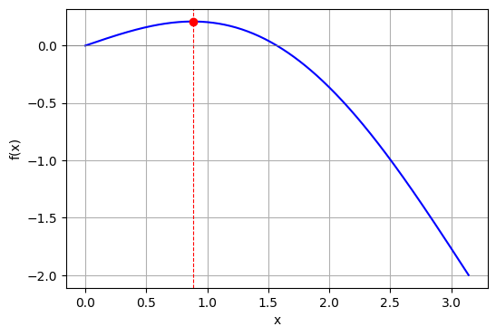
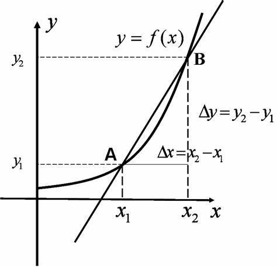
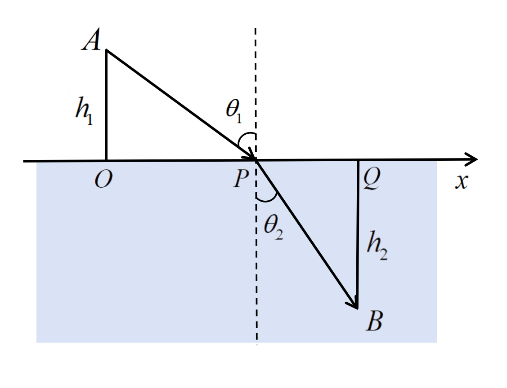
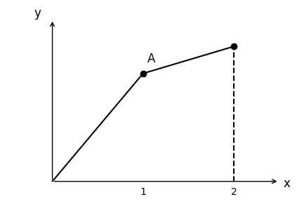

[回到主页面](index.html)

> [!tip]
> 
> ---
> 
> > ==导数是一种特殊的极限==
> > 
> > 实际问题中人们经常会考虑某个函数的**极值**, 函数的**切线方向**是分析函数极值的有力工具: 
> > 
> > - 切线斜率为正时函数单调递增
> > - 切线斜率为负时函数单调递减
> > - 切线斜率为零时函数取到极值
> > 
> > 那么怎么求函数在某处**切线的斜率**呢? 这个问题困扰了数学家好多年, 直到后来有人发现**切线斜率可以看作是一个极限**, 这个极限也叫做**导数**.
> > 
> > 由此我们也可以进一步体会到**极限**的重要性. 而在后面的章节中, 我们会再次运用**极限**来构造**积分**. 因此极限的概念相当于整个微积分的基础. 
> > 
> > 右图给出了课本各部分内容之间的关系.
> 
> > ==思维导图==
> > 
> > 

# 导数和导函数

> [!tip]
>
> - 导数是函数的**瞬时变化率**.
> - 导数是函数某处的**切线斜率**.
>
> ---
> > [!note]
> >
> > ==**导数**是研究函数性质的重要工具==
> >
> > **问题**: 计算 $\displaystyle f(x) = \sin(x) - \frac{2x}{\pi}$在$\displaystyle [0,{\pi}]$的最大值.
> >
> > **求解**: 如图所示, 
> > 对函数求导得到：$ f'(x) = \cos(x) - \frac{2}{\pi}$，
> > 令导数为 0，解得极值点：$x = \arccos\left(\frac{2}{\pi}\right)$
> >
> > - 在 $\displaystyle x < \arccos\left(\frac{2}{\pi}\right)$ 处,$\displaystyle cos(x) > \frac{2}{\pi} \Rightarrow f'(x) > 0 \\$，函数递增；
> > - 在$\displaystyle x > \arccos\left(\frac{2}{\pi}\right)$处，$cos(x) < \frac{2}{\pi} \Rightarrow f'(x) < 0 \\$，函数递减；
> >
> >因此 $x = \arccos\left(\frac{2}{\pi}\right)$ 是 **极大值点**
> >将极大值点带入原函数：
> >$f\left(\arccos\left(\frac{2}{\pi}\right)\right)
> >= \sin\left(\arccos\left(\frac{2}{\pi}\right)\right) - \frac{2}{\pi} \cdot \arccos\left(\frac{2}{\pi}\right)$
> >
> >利用恒等式：$\sin(\arccos(x)) = \sqrt{1 - x^2}$
> >
> >所以：$f_{\text{max}} = \sqrt{1 - \left(\frac{2}{\pi}\right)^2} - \frac{2}{\pi} \cdot \arccos\left(\frac{2}{\pi}\right)$
> >近似值为：$x_{\text{max}} \approx 0.88,\quad f_{\text{max}} \approx 0.21$
> >
> > 

## 导数的定义

> [!important]
>
> ---
> > ==导数的定义==
> >
> > $\displaystyle f'(x_0) = \lim_{\Delta x \rightarrow 0}\frac{f(x_0 + \Delta x) - f(x_0)}{\Delta x} = \lim_{\Delta x \rightarrow 0}\frac{\Delta y}{\Delta x}.$
> >
> > [导数的几何意义: 图]
> > 
> > 
> > 
>

> [!note]
> 
> ==由定义计算导数==
> 
> ---
> 
> > ==例1==
> > 
> > **求 $f(x) = C$ 在 $x_0=1$ 处的导数.**
> >
> > 解：根据导数的定义：
> >$\displaystyle f'(x_0) = \lim_{\Delta x \to 0} \frac{f(x_0 + \Delta x) - f(x_0)}{\Delta x} = \lim_{\Delta x \to 0} \frac{\Delta y}{\Delta x}$
> >
> >代入 $ f(x) = C \\$和 $ x_0 = 1 \\$：
> >$\displaystyle f'(1) = \lim_{\Delta x \to 0} \frac{f(1 + \Delta x) - f(1)}{\Delta x} $
> >
> >$\displaystyle = \lim_{\Delta x \to 0} \frac{C - C}{\Delta x} = \lim_{\Delta x \to 0} \frac{0}{\Delta x} = \lim_{\Delta x \to 0} 0 = 0$.
> >
> >答案为：$\displaystyle f'(1) = 0 $
> 
> > ==例2==
> > 
> > **求 $f(x) = x^2$ 在 $x_0=2$ 处的导数.**
> > 
> >解：根据导数的定义：
> >
> >$\displaystyle f'(x_0) = \lim_{\Delta x \to 0} \frac{f(x_0 + \Delta x) - f(x_0)}{\Delta x} = \lim_{\Delta x \to 0} \frac{\Delta y}{\Delta x}$
> >
> >代入 $\displaystyle f(x) = x^2 $和$\displaystyle x_0 = 2 $：
> >
> >$\displaystyle f'(2) = \lim_{\Delta x \to 0} \frac{(2 + \Delta x)^2 - 2^2}{\Delta x}  = \lim_{\Delta x \to 0} \frac{4 + 4\Delta x + (\Delta x)^2 - 4}{\Delta x} $
> >
> >化简分子并求极限：
> >$\displaystyle f'(2) = \lim_{\Delta x \to 0} \frac{4\Delta x + (\Delta x)^2}{\Delta x} = \lim_{\Delta x \to 0} \frac{\Delta x(4 + \Delta x)}{\Delta x} = \lim_{\Delta x \to 0} (4 + \Delta x)= 4 + 0 = 4$
> >
> >答案为 $\displaystyle f'(2) = 4 \\$

## 导函数

> [!tip]
> 
> 对函数 $f(x)$ 定义域上的每一点都求导 (假设每一点的导数都存在), 得到一个**新的**_~Rd~_函数, 称为**导函数**, 记作 $f'(x)$. 可知导函数是由 $f(x)$ 衍生出来的, 正好和 Derivative (导数) 的意思一致.
> 

> [!warning]
> 
> 给定位移关于时间的函数 $s(t)$, 物体的速度 $v(t)$ 便是 $s(t)$ 的导数.
> 

> [!note]
>
> ---
>
> > ==例3==
> > 
> > **求 $f(x) = x^2$ 的导函数.**
> > 
> > 解：函数 $\displaystyle f(x) = x^2 $的导数推导如下：
> >
> >$\displaystyle f'(x) = \lim_{\Delta x \to 0} \frac{f(x+\Delta x) - f(x)}{\Delta x} = \lim_{\Delta x\to 0} \frac{(x+\Delta x)^2 - x^2}{\Delta x}$
> >$\displaystyle =\lim_{\Delta x \to 0} \frac{x^2 + 2x\Delta x + \Delta x^2- x^2}{\Delta x} =\lim_{\Delta x\to 0} \frac{2x\Delta x + \Delta x^2}{\Delta x}$
> >
> >此时极限表达式变为：
> >
> >$\displaystyle f'(x) = \lim_{\Delta x \to 0} (2x + \Delta x)= 2x$
>
> > ==例4(P78例4)==
> > 
> > **求函数 $ f(x) = \cos x $ 的导数.**
> > **方法一**
> > 解：由导数的定义：
> >$\displaystyle f'(x) = \lim_{\Delta x \to 0} \frac{\cos(x + \Delta x) - \cos x}{\Delta x}$
> >
> > 利用三角恒等式：$\displaystyle \cos A - \cos B = -2 \sin\left( \frac{A + B}{2} \right) \sin\left( \frac{A - B}{2} \right)$
> >
> > 得到：$\displaystyle \cos(x + \Delta x) - \cos x = -2 \sin\left( x + \frac{\Delta x}{2} \right) \sin\left( \frac{\Delta x}{2} \right)$
> >
> >代入导数定义：
>  $\displaystyle f'(x) = \lim_{\Delta x \to 0} \frac{-2 \sin\left( x + \frac{\Delta x}{2} \right) \sin\left( \frac{\Delta x}{2} \right)}{\Delta x}$
> >
> >拆分极限：
> > $\displaystyle f'(x) = -2 \lim_{\Delta x \to 0} \sin\left( x + \frac{\Delta x}{2} \right) \cdot \lim_{\Delta x \to 0} \frac{\sin\left( \frac{\Delta x}{2} \right)}{\Delta x}$
> >
> >- 第一个极限：
> >$\displaystyle \lim_{\Delta x \to 0} \sin\left( x + \frac{\Delta x}{2} \right) = \sin x + \frac{\Delta x}{2} \cdot \cos x$
> >
> > - 第二个极限（令 $ t = \frac{\Delta x}{2} $）：
> >$\displaystyle \lim_{\Delta x \to 0} \frac{\sin\left( \frac{\Delta x}{2} \right)}{\Delta x} = \lim_{t \to 0} \frac{\sin t}{2t} = \frac{1}{2} \cdot 1 = \frac{1}{2}$
> >
> > 合并结果：$\displaystyle f'(x) = (\cos x)' =-2 \cdot \sin x \cdot \frac{1}{2} = -\sin x$
>
>
> > **方法二**
> >
> >解：由导数的定义：
>  $\displaystyle f'(x) = \lim_{\Delta x \to 0} \frac{\cos(x + \Delta x) - \cos x}{\Delta x}$
> >
> >展开 $\cos(x + \Delta x) $并带入：
> >
> >$\displaystyle f'(x) = \lim_{\Delta x \to 0} \frac{\cos x \cos \Delta x - \sin x \sin \Delta x - \cos x}{\Delta x}$
> >
> >拆分分子并化简：
> >$\displaystyle f'(x) = \lim_{\Delta x \to 0} \left[ \cos x \cdot \frac{\cos \Delta x - 1}{\Delta x} - \sin x \cdot \frac{\sin \Delta x}{\Delta x} \right]$
> >
> > 计算关键极限：
> > - 已知极限：$\displaystyle \lim_{\Delta x \to 0} \frac{\sin \Delta x}{\Delta x} = 1$
> >
> >- 计算 $\displaystyle \frac{\cos \Delta x - 1}{\Delta x}$：
> >
> >利用三角恒等式:
> >
> >$\displaystyle\frac{\cos \Delta x - 1}{\Delta x} = -2 \cdot \frac{\sin^2\left(\frac{\Delta x}{2}\right)}{\Delta x} = -\frac{\sin\left(\frac{\Delta x}{2}\right)}{\frac{\Delta x}{2}} \cdot \sin\left(\frac{\Delta x}{2}\right)$
> >
> >令 $\displaystyle t = \frac{\Delta x}{2} $，，当 $\Delta x \to 0 $ 时 $t \to 0 $，则：
> >
> >$\displaystyle\lim_{\Delta x \to 0} \frac{\cos \Delta x - 1}{\Delta x} = -\lim_{t \to 0} \left( \frac{\sin t}{t} \cdot \sin t \right) = -1 \cdot 0 = 0$
> >
> >合并结果：
> >$\displaystyle f'(x) = (\cos x)' =-2 \cdot \sin x \cdot \frac{1}{2} = -\sin x$  
> >
> >用类似的方法可以求得 $\sin x$ 的导数
> >即：$$(\sin x)' = \cos x$$

> [!note]
>
> ---
>
> > ==例5(P77例2)== 
> >
> >**求正整数次幂函数 $ f(x) = x^m $ 的导数.**
> >
> >解：当 $ m = 1 $ 时：
   $\displaystyle f'(x) = \lim_{\Delta x \to 0} \frac{(x+\Delta x) - x}{\Delta x} = \lim_{\Delta x \to 0} \frac{\Delta x}{\Delta x} = 1$
> >
> >当 $ m > 1 $时：
   $\displaystyle f'(x) = \lim_{\Delta x \to 0} \frac{(x+\Delta x)^m - x^m}{\Delta x}$
> >
> >展开多项式：
   $\displaystyle (x+\Delta x)^m = x^m + m x^{m-1} \Delta x + \frac{m(m-1)}{2} x^{m-2} (\Delta x)^2 + \cdots + (\Delta x)^m$
> >
> >代入后化简：
   $\displaystyle f'(x) = \lim_{\Delta x \to 0} \left[ m x^{m-1} + \frac{m(m-1)}{2} x^{m-2} \Delta x + \cdots + (\Delta x)^{m-1} \right] = m x^{m-1}$
> >
> >最终结果为：  
$$(x^m)' = 
\begin{cases} 
1, & m = 1, \\
m x^{m-1}, & m > 1.
\end{cases}$$
>
>
> > ==例6(P77例3)== 
> >
> >**求函数 $f(x) = x^\alpha $ 的导数.  ($\alpha\in\mathbb{R} $)**
> >
> >解：由导数的定义：
   $\displaystyle f'(x) = \lim_{\Delta x \to 0} \frac{(x+\Delta x)^\alpha - x^\alpha}{\Delta x}$
> >
> > 提取公共因子：
   $\displaystyle \frac{(x+\Delta x)^\alpha - x^\alpha}{\Delta x} = x^{\alpha-1} \cdot \frac{\left( 1 + \frac{\Delta x}{x} \right)^\alpha - 1}{\frac{\Delta x}{x}}$
> >
> >变量代换：  
   令 $ t = \frac{\Delta x}{x} $，则当 $ \Delta x \to 0 $ 时 $ t \to 0 $，极限转化为：$\displaystyle f'(x) = x^{\alpha-1} \cdot \lim_{t \to 0} \frac{(1 + t)^\alpha - 1}{t}$
> >  
> >利用幂函数展开式 $(1 + t)^\alpha \approx 1 + \alpha t $(当 $ t \to 0 $)：$\displaystyle \lim_{t \to 0} \frac{(1 + \alpha t) - 1}{t} = \alpha$
> >
> >结果为：$\displaystyle f'(x) = \alpha x^{\alpha-1}$

> [!note]
> 
> ---
> 
> > ==例7(P78例5)== 
> >
> >**给定函数 $ f(x) = q^x $，其中底数 $ q $ 是大于 0 且不等于 1 的常数，求导函数 $ f'(x) $**
> >
> >解：由导数定义：
$\displaystyle f'(x) = \lim_{\Delta x \to 0} \frac{f(x + \Delta x) - f(x)}{\Delta x}$
> >
> >代入函数 $ f(x) = q^x $ 得：
> >
> >$\displaystyle f'(x) = \lim_{\Delta x \to 0} \frac{q^{x + \Delta x} - q^x}{\Delta x}= \lim_{\Delta x \to 0} \frac{q^x \cdot q^{\Delta x} - q^x}{\Delta x}= q^x \cdot \lim_{\Delta x \to 0} \frac{q^{\Delta x} - 1}{\Delta x}$
> >
> >根据极限性质，有：$\displaystyle \lim_{\Delta x \to 0} \frac{q^{\Delta x} - 1}{\Delta x} = \ln q$
> >
> >因此，$f'(x) = q^x \cdot \ln q$
> >这就是指数函数的导数公式。当 $ u = e $ 时，因 $ \ln e = 1 $，故有：$(e^x)' = e^x$
>
>---
>
>
> > ==例8(P79例6)== 
> >
> >**求对数函数 $ f(x) = \log_u x $ 的导数, 其中$u$是大于0且不等于1的常数.**
> >
> >解：由导数的定义：
   $\displaystyle f'(x) = \lim_{\Delta x \to 0} \frac{\log_u (x + \Delta x) - \log_u x}{\Delta x}$
> >
> >应用对数性质：
   利用换底公式 $\displaystyle \log_u a = \frac{\ln a}{\ln u} $，将分子转换为自然对数：
> >
> >$\displaystyle f'(x) = \lim_{\Delta x \to 0} \frac{\frac{\ln(x + \Delta x)}{\ln u} - \frac{\ln x}{\ln u}}{\Delta x} = \frac{1}{\ln u} \cdot \lim_{\Delta x \to 0} \frac{\ln\left(1 + \frac{\Delta x}{x}\right)}{\Delta x}$
> >
> >变量代换：  
   令 $\displaystyle h = \frac{\Delta x}{x} $，当 $ \Delta x \to 0 $ 时 $ h \to 0 $，则：
   $\displaystyle f'(x) = \frac{1}{\ln u} \cdot \lim_{h \to 0} \frac{\ln(1 + h)}{x \cdot h} = \frac{1}{x \ln u} \cdot \lim_{h \to 0} \frac{\ln(1 + h)}{h}$
> >
> >关键极限：  
$\displaystyle \lim_{h \to 0} \frac{\ln(1 + h)}{h} = \lim_{h \to 0} \ln\ (1 + h)^{\frac{1}{h}}  = \ln\left( \lim_{h \to 0} (1 + h)^{\frac{1}{h}} \right) = \ln e = 1$
> >
> >结果为：
   $\displaystyle f'(x) = \frac{1}{x \ln u} \cdot 1 = \frac{1}{x \ln u}$

> [!caution]
> 
> ==连续与可导的关系==
> 
> 可导必连续, 连续不一定可导. 
> 

> [!note]
> 
> ---
> 
> > ==反例1==
> > 
> > **$f(x) = |x|$**
> >
> > - 连续：绝对值函数在 $ x = 0 $ 处是连续的，因为：
$\displaystyle \lim_{x \to 0^-} |x| = 0, \quad \lim_{x \to 0^+} |x| = 0, \quad f(0) = 0.$
> >
> > - 可导性：$ f(x) = |x| $ 在 $ x=0 $ 处的导数
> >由导数的定义：
> >$f'(0) = \displaystyle \lim_{\Delta x \to 0} \frac{f(0+\Delta x)-f(0)}{\Delta x} = \lim_{\Delta x \to 0} \frac{|\Delta x| - 0}{\Delta x} = \lim_{\Delta x \to 0} \frac{|\Delta x|}{\Delta x}$
> >
> >当 $ \Delta x < 0 $ 时：  
> >
> >$\displaystyle \frac{|\Delta x|}{\Delta x} = \frac{-\Delta x}{\Delta x} = -1 \quad \Rightarrow \quad \lim_{\Delta x \to 0^-} \frac{|\Delta x|}{\Delta x} = -1$
> >
> >当 $ \Delta x > 0 $ 时：  
> >
> >$\displaystyle \frac{|\Delta x|}{\Delta x} = \frac{\Delta x}{\Delta x} = 1 \quad \Rightarrow \quad \lim_{\Delta x \to 0^+} \frac{|\Delta x|}{\Delta x} = 1 $
> >
> >由于左极限 ($-1$) 与右极限 ($1$) 不相等，故极限: $\displaystyle \lim_{\Delta x \to 0} \frac{|\Delta x|}{\Delta x}$不存在。因此，函数 $ f(x) = |x| $ 在 $ x=0 $ 处不可导。
> >
> > **故连续不一定可导**
> >
> 
> > ==反例2==
> > 
> > **$f(x) = x^{\frac{1}{3}}$**
> > - 连续性：立方根函数在所有实数点（包括 $ x = 0 $）都是连续的，因为：$\displaystyle \lim_{x \to 0} x^{\frac{1}{3}} = 0 = f(0).$
> > - 可导性  
计算$f(x)$的导数：$f'(x) = \frac{1}{3} x^{-\frac{2}{3}} \quad (x \neq 0).$
当 $ x \to 0 $ 时，$ f'(x) \to \infty $，即导数在 $ x = 0 $ 处**不存在**（无穷大导数）。
> >
> >**故连续不一定可导**
> >
> >

> [!caution]
> 
> ==单侧导数==
>
>根据函数 $ f(x) $ 在点 $ x_0 $ 处的导数 $ f'(x_0) $ 的定义，导数  
>$$\displaystyle f'(x_0) = \lim_{\Delta x  \to 0} \frac{f(x_0 + \Delta x ) - f(x_0)}{\Delta x }$$
>是一个极限，而极限存在的充分必要条件是左、右极限都存在且相等。因此，$ f'(x_0) $ 存在（即 $ f(x) $ 在点 $ x_0 $ 处可导）的充分必要条件是左、右极限  $\displaystyle\lim_{\Delta x  \to 0^-} \frac{f(x_0 + \Delta x ) - f(x_0)}{\Delta x } $ 及 $\displaystyle\lim_{\Delta x \to 0^+} \frac{f(x_0 + \Delta x ) - f(x_0)}{\Delta x }$ 都存在且相等。
>
>
> - **左导数与右导数的定义**
这两个极限分别称为函数 $ f(x) $ 在点 $ x_0 $ 处的**左导数**和**右导数**，记作 $ f'_-(x_0) $ 及 $ f'_+(x_0) $，即  
$\displaystyle f'_-(x_0) = \lim_{\Delta x  \to 0^-} \frac{f(x_0 + \Delta x ) - f(x_0)}{\Delta x },$  
$\displaystyle f'_+(x_0) = \lim_{\Delta x  \to 0^+} \frac{f(x_0 + \Delta x ) - f(x_0)}{\Delta x }.$
>
> - **可导的充要条件**：  
函数 $ f(x) $ 在点 $ x_0 $ 处可导的充分必要条件是左导数 $ f'_-(x_0) $ 和右导数 $ f'_+(x_0) $ 都存在且相等。
>
> - **左导数和右导数统称为单侧导数**。  
> - **闭区间上的可导性**：  
  如果函数 $ f(x) $  在开区间 $ (a, b) $ 内可导, 左端点右导数 $ f'_+(a) $ 和右端点左导数 $ f'_-(b) $ 均存在, 则称 $ f(x) $ 在闭区间 $ [a, b] $ 上**可导**

# 导数的计算

## 初等函数的导数
> [!tip]
> 
> 首先我们给出初等函数的导数公式.
> 

> [!important]
> 
> ==常见初等函数的求导公式==
> 1. 幂函数
> - 如果 $f(x) = x^n$，则：
> $$f'(x) = n \cdot x^{n-1}$$
> 
> 2. 指数函数
> - 如果 $f(x) = e^x$，则：
> $$f'(x) = e^x$$
> 
> - 如果 $f(x) = a^x$，则：
> $$f'(x) = a^x \ln(a)$$
> 
> 3. 对数函数
> - 如果 $f(x) = \ln(x)$，则：
> $$f'(x) = \frac{1}{x}$$
> 
> - 如果 $f(x) = \log_a(x)$，则：
> $$f'(x) = \frac{1}{x \ln(a)}$$
> 
> 4. 三角函数
> - 如果 $f(x) = \sin(x)$，则：
> $$f'(x) = \cos(x)$$
> 
> - 如果 $f(x) = \cos(x)$，则：
> $$f'(x) = -\sin(x)$$
> 
> - 如果 $f(x) = \tan(x)$，则：
> $$f'(x) = \sec^2(x)$$
> 
> 5. 反三角函数
> - 如果 $f(x) = \arcsin(x)$，则：
> $$f'(x) = \frac{1}{\sqrt{1 - x^2}}$$
> 
> - 如果 $f(x) = \arccos(x)$，则：
> $$f'(x) = \frac{-1}{\sqrt{1 - x^2}}$$
> 
> - 如果 $f(x) = \arctan(x)$，则：
> $$f'(x) = \frac{1}{1 + x^2}$$

## 导数的四则运算

> [!tip]
> 
> 下面的导数四则法则能够方便我们计算导数. 这些法则都可以根据导数的定义加以证明.
> 

> [!important]
> 
> ==导数的四则运算法则==
> 
> **1. 和差法则（Sum and Difference Rules）**
> 若函数 $f(x)$ 和 $g(x)$ 在点 $x$ 处可导，则：
>
> $\displaystyle\frac{d}{dx}[f(x) \pm g(x)] = f'(x) \pm g'(x)$
>
> **证明：**
> 根据导数的定义：
$\displaystyle\frac{d}{dx}[f(x) \pm g(x)] = \lim_{h \to 0} \frac{[f(x+h) \pm g(x+h)] - [f(x) \pm g(x)]}{h}$
>
> 分拆后：
$\displaystyle = \lim_{h \to 0} \left( \frac{f(x+h) - f(x)}{h} \pm \frac{g(x+h) - g(x)}{h} \right)$
>
> 利用极限的线性性质：
>
>$\displaystyle= \lim_{h \to 0} \frac{f(x+h) - f(x)}{h} \pm \lim_{h \to 0} \frac{g(x+h) - g(x)}{h}$
>
> 所以：
> $$\frac{d}{dx}[f(x) \pm g(x)] = f'(x) \pm g'(x)$$
>
> **2. 乘积法则（Product Rule）**
> 若函数 $f(x)$ 和 $g(x)$ 在点 $x$ 处可导，则：
> $\displaystyle\frac{d}{dx}[f(x) \cdot g(x)] = f'(x)g(x) + f(x)g'(x)$
>
> **证明：**
> 根据导数的定义：
> $\displaystyle  \frac{d}{dx}[f(x)g(x)] = \lim_{h \to 0} \frac{f(x+h)g(x+h) - f(x)g(x)}{h}$
>
> 加减 $f(x+h)g(x)$ 项：
> $\displaystyle = \lim_{h \to 0} \frac{[f(x+h)g(x+h) - f(x+h)g(x)] + [f(x+h)g(x) - f(x)g(x)]}{h}$
>
> 拆分并整理：
> $\displaystyle  = \lim_{h \to 0} \left( f(x+h) \frac{g(x+h) - g(x)}{h} + g(x) \frac{f(x+h) - f(x)}{h} \right)$
>
> 当 $h \to 0$ 时，$f(x+h) \to f(x)$：
> $$
> = f(x) \cdot g'(x) + g(x) \cdot f'(x)
> $$
> 因此：
> $$
> \frac{d}{dx}[f(x)g(x)] = f'(x)g(x) + f(x)g'(x)
> $$
>
> **3. 商法则（Quotient Rule）**
> 若函数 $f(x)$ 和 $g(x)$ 在点 $x$ 处可导，且 $g(x) \ne 0$，则：
>
> $\displaystyle\frac{d}{dx}\left[ \frac{f(x)}{g(x)} \right] = \frac{f'(x)g(x) - f(x)g'(x)}{[g(x)]^2}$
>
> **证明：**
> 根据导数的定义：
> $$
> \frac{d}{dx}\left[ \frac{f(x)}{g(x)} \right] = \lim_{h \to 0} \frac{\frac{f(x+h)}{g(x+h)} - \frac{f(x)}{g(x)}}{h}
> $$
> 通分并整理：
> $$
> = \lim_{h \to 0} \frac{[f(x+h)g(x) - f(x)g(x+h)]}{h \cdot g(x)g(x+h)}
> $$
> 分拆分子：
>$\displaystyle = \lim_{h \to 0} \left( \frac{f(x+h) - f(x)}{h} \cdot \frac{g(x)}{g(x)g(x+h)} - \frac{g(x+h) - g(x)}{h} \cdot \frac{f(x)}{g(x)g(x+h)} \right)$
>
> 当 $h \to 0$ 时，$g(x+h) \to g(x)$：
> $$
> = \frac{f'(x)g(x)}{[g(x)]^2} - \frac{f(x)g'(x)}{[g(x)]^2}
> $$
> 因此：
> $$
> \frac{d}{dx}\left[ \frac{f(x)}{g(x)} \right] = \frac{f'(x)g(x) - f(x)g'(x)}{[g(x)]^2}
> $$

> [!note]
> 
> >==P86 例1== 
> >
> >**求函数 $ y = 3x^3 - 4x^2 + 5x - 9 $ 的导数 $ y' $.**
> >
> >$\begin{aligned}
> >解：y' &= (3x^3 - 4x^2 + 5x - 9)' \\
&= (3x^3)' - (4x^2)' + (5x)' - (9)' \quad  \\
&= 3 \cdot 3x^{3-1} - 4 \cdot 2x^{2-1} + 5 \cdot 1x^{1-1}\\
&= 9x^2 - 8x + 5 \quad 
\end{aligned}$
> 
> 
> ==P86 例2==
> >
> >**设 $y = 2e^{x}(\sin x + 2\cos x)$，求 $y'$**
> >
> >$\begin{aligned}
解：y' &= (2e^{x})'(\sin x + 2\cos x) + 2e^{x}(\sin x + 2\cos x)' \\
&= 2e^{x}(\sin x + 2\cos x) + 2e^{x}(\cos x - 2\sin x) \\
&= 2e^{x}\sin x + 4e^{x}\cos x + 2e^{x}\cos x - 4e^{x}\sin x \\
&= 6e^{x}\cos x - 2e^{x}\sin x \\
&= 2e^{x}(3\cos x - \sin x)
\end{aligned}$
>
> ==P86 例3==
> >**求函数 $ f(x) = x^3 + 3\sin x + \frac{5}{2} $ 的导数 $ f'(x) $ 及 $ f'\left(\frac{\pi}{4}\right) $**
> >
> >$\begin{aligned}
   解：f'(x) &= \left( x^3 + 3\sin x + \frac{5}{2} \right)' \\
   &= (x^3)' + (3\sin x)' + \left( \frac{5}{2} \right)' \quad \\
   &= 3x^2 + 3\cos x + 0 \quad \\
   &= 3x^2 + 3\cos x.
   \end{aligned}$
> >
> > $\begin{aligned}\ \ \ \ \ \ \ 
   f'\left( \frac{\pi}{4} \right) &= 3\left( \frac{\pi}{4} \right)^2 + 3\cos\left( \frac{\pi}{4} \right) \\
   &= 3 \cdot \frac{\pi^2}{16} + 3 \cdot \frac{\sqrt{2}}{2} \quad \\
   &= \frac{3\pi^2}{16} + \frac{3\sqrt{2}}{2}.
   \end{aligned}$
>
>
>==P86 例4==
> >
> >**设 $y = \tan x$，求 $y$ 的导数 $y'$**
> >
> >解：
$\displaystyle y' = (\tan x)' = \left( \frac{\sin x}{\cos x} \right)' = \frac{(\sin x)' \cos x - \sin x (\cos x)'}{\cos^2 x} $
> >
> >$\displaystyle = \frac{\cos^2 x + \sin^2 x}{\cos^2 x} = \frac{1}{\cos^2 x} = \sec^2 x$
> >
>
> >
> ==P87 例5==
> >
> > **余切函数 $y = \cot x $，求 $ y' $**
> >
> >解：$\displaystyle y' = (\cot x)' = \left( \frac{\cos x}{\sin x} \right)' = \frac{(\cos x)' \sin x - \cos x (\sin x)'}{\sin^2 x} $
> >
> >$\displaystyle= \frac{(-\sin x) \sin x - \cos x (\cos x)}{\sin^2 x} = \frac{-\sin^2 x - \cos^2 x}{\sin^2 x}$
> >
> >$\displaystyle = \frac{-(\sin^2 x + \cos^2 x)}{\sin^2 x} = \frac{-1}{\sin^2 x} = -\csc^2 x$
> >
> >即$\displaystyle (\cot x)' = -\csc^2 x.$
> >
> >同理，还可求得正割函数和余割函数的导数公式：
> >
> >  $(\sec x)' = \sec x \tan x.$
> >
> >  $\left( \csc x \right)' = -\csc x \cot x.$

## 复合函数求导的链式法则
> [!tip]
> 
> 非常重要!
> 

> [!important]
> 
> ==链式法则 (Chain Rule)==
> 若函数 $y = f(u)$ 在点 $u = g(x)$ 可导，且 $u = g(x)$ 在点 $x$ 可导，则：
> $$
> \frac{dy}{dx} = \frac{dy}{du} \cdot \frac{du}{dx}
> $$
> **证明：**
> 根据导数的定义：
> $$
> \frac{dy}{dx} = \lim_{h \to 0} \frac{f(g(x+h)) - f(g(x))}{h}
> $$
> 添加并减去 $f(g(x) + [g(x+h) - g(x)])$：
> $$
> = \lim_{h \to 0} \frac{f(g(x) + \Delta u) - f(g(x))}{\Delta u} \cdot \frac{\Delta u}{h}
> $$
> 其中 $\Delta u = g(x+h) - g(x)$。当 $h \to 0$，$\Delta u \to 0$：
> $$
> = \frac{df}{du} \cdot \frac{dg}{dx}
> $$
> 因此：
> $$
> \frac{dy}{dx} = \frac{dy}{du} \cdot \frac{du}{dx}
> $$

> [!note]
> 
> ==P90 例9== 
> >
> > **设函数$ y = e^{x^2} $，求 $\frac{dy}{dx}$**
> >
> >解：$ y = e^{x^2} $ 可看作由 $ y = e^u $，$ u = x^2 $ 复合而成，因此：
> >  
> >$\displaystyle \frac{dy}{dx} = \frac{dy}{du} \cdot \frac{du}{dx} = e^u \cdot 2x = 2xe^{x^2}.$
> 
> ==P90 例10==
> >
> >**设函数$ y = \cos \frac{x^2-1}{3x} $，求 $\frac{dy}{dx}$**
> >
> >解：$ y = \cos \frac{x^2-1}{3x} $ 可看作由 $\displaystyle  y = \cos u, u = \frac{x^2-1}{3x} $ 复合而成。因
> >$\displaystyle \frac{dy}{du} = -\sin u,$
> >$\displaystyle \frac{du}{dx} = \frac{(2x)(3x) - (x^2-1)(3)}{(3x)^2} = \frac{6x^2 - 3x^2 + 3}{9x^2}$
> >
> >$\displaystyle = \frac{3x^2 + 3}{9x^2} = \frac{x^2 + 1}{3x^2},$
> >所以
> >
> >$\displaystyle \frac{dy}{dx} = -\sin u \cdot \frac{x^2 + 1}{3x^2} = -\frac{x^2 + 1}{3x^2} \cdot \sin \frac{x^2-1}{3x}$
>
>
> >
> ==P91 例11==
> >
> >**设 $ y = \ln \cos x $，求 $\frac{dy}{dx}$**.
> >
> >解：$ y = \ln \cos x $ 可看作由 $ y = \ln u $，$ u = \cos x $ 复合而成。因
> >$\displaystyle \frac{dy}{du} = \frac{1}{u},$$\displaystyle \frac{du}{dx} = -\sin x,$
> >
> >所以
$\displaystyle \frac{dy}{dx} = \frac{dy}{du} \cdot \frac{du}{dx} = \frac{1}{\cos x} \cdot (-\sin x) = -\frac{\sin x}{\cos x} = -\tan x.$
> >
>
> ==P92 例12==
> >
> >**设 $ y = \sqrt{1 + 3x^3} $，求 $\frac{dy}{dx}$.**
> >
> >解：$ y = \sqrt{1 + 3x^3} = (1 + 3x^3)^{\frac{1}{2}} $ 可看作由 $ y = u^{\frac{1}{2}} $，$ u = 1 + 3x^3 $ 复合而成。因
> >$\displaystyle \frac{dy}{du} = \frac{1}{2}u^{-\frac{1}{2}} = \frac{1}{2\sqrt{u}},$ $\displaystyle \frac{du}{dx} = 9x^2,$
> >
> >所以
> >$\displaystyle \frac{dy}{dx} = \frac{dy}{du} \cdot \frac{du}{dx} = \frac{1}{2\sqrt{1 + 3x^3}} \cdot 9x^2 = \frac{9x^2}{2\sqrt{1 + 3x^3}}$
>
>
> ==P92 例13==
> >
> >**设 $ y = \ln \sin(2x^2) $，求 $\frac{dy}{dx}$**
> > 
> >解：所给函数可分解为 $ y = \ln u, u = \sin v, v = 2x^2 $。因
> >$\displaystyle \frac{dy}{du} = \frac{1}{u}, \quad \frac{du}{dv} = \cos v, \quad \frac{dv}{dx} = 4x$ 故$\displaystyle \frac{dy}{dx} = \frac{1}{u} \cdot \cos v \cdot 4x$ $\displaystyle= \frac{\cos(2x^2)}{\sin(2x^2)} \cdot 4x = 4x \cot(2x^2)$
>
> ==P92 例14==
> >
> >**设 $ y = e^{\cos \sqrt{x}} $，求 $ y' $**
> >
> >解：逐层求导：
$\displaystyle \frac{dy}{du} = e^u = e^{\cos \sqrt{x}}$$\displaystyle \frac{du}{dv} = -\sin v = -\sin \sqrt{x}$$\displaystyle \frac{dv}{dx} = \frac{1}{2}x^{-1/2} = \frac{1}{2\sqrt{x}}$
> >
> >根据链式法则：
> >
> >$\displaystyle y' = \frac{dy}{du} \cdot \frac{du}{dv} \cdot \frac{dv}{dx} = e^{\cos \sqrt{x}} \cdot (-\sin \sqrt{x}) \cdot \frac{1}{2\sqrt{x}}= -\frac{e^{\cos \sqrt{x}} \sin \sqrt{x}}{2\sqrt{x}}$
>
>
> ==P93 例15==
> >
> >**设 $ y = \cos 2x \cdot \cos^2 x $，求 $ y' $**
> >
> >解：应用积的求导法则：
> >
> >$y' = (\cos 2x)' \cos^2 x + \cos 2x (\cos^2 x)'$
> >$= -2\sin 2x \cos^2 x + \cos 2x (-2\sin x \cos x)$
$= -2\cos x (\sin 2x \cos x + \cos 2x \sin x)$
$= -2\cos x \sin 3x$

# 隐函数的导数

## 隐函数求导

> [!tip]
> 
> 隐函数将自变量 $x$ 和函数值 $y$ 通过某个等式联系起来, 从这个等式里我们可以推测 $\Delta y$ 和 $\Delta x$ 之间的关系, 一些复杂的函数的导数通过隐函数更容易计算.
> 

> [!note]
> 
> ==P101 例1==
> >**求由方程 $ \ln y + x^2y - 1 = 0 $ 所确定的隐函数的导数 $\frac{dy}{dx}$**.
> >
> >解：将方程两边对 $ x $ 求导，注意 $ y $ 是 $ x $ 的函数：
> >
> >左边求导：$\displaystyle \frac{d}{dx}(\ln y + x^2y - 1) = \frac{1}{y}\frac{dy}{dx} +2xy + x^2\frac{dy}{dx}$
> >右边求导：$\displaystyle \frac{d}{dx}(0) = 0$
> >
> >令两边相等：$\displaystyle \frac{1}{y}\frac{dy}{dx} + 2xy + x^2\frac{dy}{dx} = 0$
> >
> >合并关于 $\frac{dy}{dx}$ 的项：
> >$\displaystyle \left(\frac{1}{y} + x^2\right)\frac{dy}{dx} = -2xy$
> >
> >解得：$\displaystyle \frac{dy}{dx} = -\frac{2xy}{\frac{1}{y} + x^2} = -\frac{2xy^2}{1 + x^2y} \quad (y \ne 0)$
> >即 $\displaystyle \frac{dy}{dx} = -\frac{2xy^2}{1 + x^2y}$
> >
> 
> ==P102 例2==
> >
> >**求由方程 $ y^3 + 3y - x^2 - 2x^5 = 0 $ 所确定的隐函数在 $ x = 0$ 处的导数 $\left.\frac{dy}{dx}\right|_{x=0}$**.
> >
> >解：将方程两边对 $ x $ 求导（注意 $ y $ 是 $ x $ 的函数）：$\displaystyle \frac{d}{dx}(y^3 + 3y - x^2 - 2x^5) $
> >
> >$\displaystyle = 3y^2 \frac{dy}{dx} + 3 \frac{dy}{dx} - 2x - 10x^4 = 0$
> >
> >解关于 $\displaystyle\frac{dy}{dx}$的方程:
> >
> >$\displaystyle (3y^2 + 3)\frac{dy}{dx} = 2x + 10x^4$
> >
> >解得:$\displaystyle \frac{dy}{dx} = \frac{2x + 10x^4}{3y^2 + 3}$
> >
> >求 $ x = 0 $ 时的 $ y $ 值:
> >
> >$\displaystyle y^3 + 3y - 0 - 0 = 0 \Rightarrow y^3 + 3y = 0 \Rightarrow y(y^2 + 3) = 0$
> >
> >解得实数解为 $ y = 0 $
> >
> >计算 $ x = 0 $ 处的导数值:
> >将 $ x = 0 $, $ y = 0 $ 代入导数表达式：$\displaystyle \left.\frac{dy}{dx}\right|_{x=0}= \frac{0 + 0}{0 + 3} = 0$

>==P102 例3==
>>**求双曲线 $\frac{x^2}{9} - \frac{y^2}{4} = 1$ 在点 $(3\sqrt{2}, 2)$ 处的切线方程**.
> >
> > 解：对双曲线方程两边关于 $x$ 求导：
> >
> >$\displaystyle \frac{2x}{9} - \frac{2y}{4}\cdot\frac{dy}{dx} = 0 \Rightarrow \frac{x}{9} - \frac{y}{2}\cdot\frac{dy}{dx} = 0$
> >
> >解得：$\displaystyle \frac{dy}{dx} = \frac{2x}{9y}$
> >
> >计算切点处斜率,在点 $(3\sqrt{2}, 2)$ 处：$\displaystyle k = \left.\frac{dy}{dx}\right|_{(3\sqrt{2},2)} = \frac{2 \times 3\sqrt{2}}{9 \times 2} = \frac{\sqrt{2}}{3}$
> >
> >于是所求的切线方程为：
> >$\displaystyle y - 2 = \frac{\sqrt{2}}{3}(x - 3\sqrt{2})\Rightarrow 3y - 6 = \sqrt{2}x - 6 \Rightarrow \sqrt{2}x - 3y = 0$
> >
## 反函数求导

> [!tip]
> 
> $y = f(x)$ 的导数是看 $\Delta y$ 随 $\Delta x$ 的变化率, 其反函数 $x = f(y)$ 的导数是看 $\Delta x$ 随 $\Delta y$ 的变化率, 而的 $\Delta x$ 与 $\Delta y$ 之间的关系可以通过隐函数确定.
> 

> [!note]
>
> ==P88 例6==
> > [不要用书上的做法, 用隐函数求导]
> > **设 $ y = \arcsin x $ ($ -1 < x < 1 $)，用隐函数求导法求 $ y' $**
> >
> > 解：由 $ y = \arcsin x $ 可得直接函数关系：$x = \sin y$
> > 对 $ x = \sin y $ 两边关于 $ x $ 求导（注意 $ y $ 是 $ x $ 的函数）：
> > $\displaystyle \frac{d}{dx}(x) = \frac{d}{dx}(\sin y)$
> >
> > $\displaystyle1 = \cos y \cdot \frac{dy}{dx}$
> >
> >将 $\cos y $用$ x $表示
> >
> > 利用三角恒等式：
> > $\displaystyle \cos y = \sqrt{1 - \sin^2 y} = \sqrt{1 - x^2}$（当 $ -\frac{\pi}{2} < y < \frac{\pi}{2} $ 时，$ \cos y > 0 $，故取正根）
> >
> > 故得到结果：$\displaystyle \frac{dy}{dx} =(\arcsin x)' = \frac{1}{\sqrt{1 - x^2}}$
> > 用类似的方法可得反余弦函数的导数公式
> > $\displaystyle (\arccos x)' = -\frac{1}{\sqrt{1-x^2}}$
> 
> > ==P88 例7==
> > [不要用书上的做法, 用隐函数求导]
> > **设 $ y = \arctan x $ ($ x \in \mathbb{R} $)，用隐函数求导法求 $ y' $**
> >
> > 解：由 $ y = \arctan x $ 可得直接函数关系：$x = \tan y$
> > 对 $ x = \tan y $ 两边关于 $ x $ 求导（注意 $ y $ 是 $ x $ 的函数）：
> > $\displaystyle \frac{d}{dx}(x) = \frac{d}{dx}(\tan y)$
> >
> >$\displaystyle 1 = \sec^2 y \cdot \frac{dy}{dx}$
> >
> >$\displaystyle \frac{dy}{dx} = \frac{1}{\sec^2 y}$
> >
> > 将 $ \sec^2 y $ 用 $ x $ 表示:
> >
> > 利用三角恒等式：$\displaystyle \sec^2 y = 1 + \tan^2 y = 1 + x^2$ 故得到结果：
> > $\displaystyle \frac{dy}{dx}=(\arctan x)' = \frac{1}{1 + x^2}$
> > 用类似的方法可得反余切函数的导数公式 $\displaystyle (arccot x)' = -\frac{1}{1+x^2}$

> [!note]
> 
> ==P103 例5==
> >
> >**求 $ y = (x^2)^{\ln x} $（$ x > 0 $）的导数**
> >
> >解： 利用对数求导法
> >两边取对数: 
> >$\displaystyle\ln y = \ln \left( (x^2)^{\ln x} \right) = \ln x \cdot \ln(x^2)=\ln x \cdot 2\ln x=2(\ln x)^2$
> >
> >两边对 $ x $ 求导得：
> >$\displaystyle\frac{1}{y} \cdot y' = 2 \cdot 2\ln x \cdot \frac{1}{x} = \frac{4\ln x}{x}$
> >
> >解出 $ y' $得到：
> >$\displaystyle\ y' = y \cdot \frac{4\ln x}{x} = (x^2)^{\ln x} \cdot \frac{4\ln x}{x}$
> > 
> 
> ==P103 例6==
> >
> >**求 $ \displaystyle y = \sqrt{\frac{(x-1)(x-2)}{(x-4)(x-5)} } $ 的导数**
> >
> >解：假设 $ x > 5 $，在等式两边取对数：
> >$\displaystyle\ln y = \frac{1}{2} [ \ln(x-1) + \ln(x-2) \\- \ln(x-4) - \ln(x-5) ]$
> >
> >对两边关于 $ x $ 求导（注意 $ y $ 是 $ x $ 的函数）：
> >
> >$\displaystyle\frac{1}{y} y' = \frac{1}{2} ( \frac{1}{x-1} + \frac{1}{x-2}$
> >$\displaystyle  - \frac{1}{x-4} - \frac{1}{x-5})$
> >
> >整理得到导数表达式：
> >
> >$\displaystyle\ y' = \frac{y}{2} ( \frac{1}{x-1} + \frac{1}{x-2}$
> >$\displaystyle - \frac{1}{x-4} - \frac{1}{x-5})$
> >
> >将 $\displaystyle y = \sqrt{\frac{(x-1)(x-2)}{(x-4)(x-5)} } $ 代入：
> >
> >$\displaystyle\ y' = \frac{1}{2} \sqrt{\frac{(x-1)(x-2)}{(x-4)(x-5)}}( \frac{1}{x-1}$
> >$\displaystyle + \frac{1}{x-2} - \frac{1}{x-4} - \frac{1}{x-5})$

# 高阶导数
> [!tip]
> 
> 导函数也是函数, 所以可以继续对导函数求导, 也就是二阶导数. 二阶导数反应了导函数的变化率. 依次可以继续到三阶导数, 四阶导数, ...
> 

> [!caution]
> 
> ==二阶导数==
> 
> $f''(x) = (f'(x))'$
>
> ==常用记号==
> 
> - $f'(x)$, $f''(x)$, $f'''(x)$, $f^{(n)}(x)$, $\cdots$.
> - $\displaystyle \frac{d}{dx}f(x)$, $\displaystyle \frac{d^2}{dx^2}f(x)$, $\displaystyle \frac{d^3}{dx^3}f(x)$, $\displaystyle \frac{d^{n}}{dx^{n}}f(x)$, $\cdots$.
> 

> [!note]
> 
> ==P97 例1==
> >
> >**设 $ y = ax^2 + bx + c $，求 $ y'' $**
> >
> >解： 求一阶导数 $ y' $ ：
$\displaystyle y' = \frac{d}{dx}(ax^2) + \frac{d}{dx}(bx) + \frac{d}{dx}(c) = 2ax + b $
> >
> >求二阶导数 $ y'' $ ：
$\displaystyle y'' = \frac{d}{dx}(2ax) + \frac{d}{dx}(b) = 2a + 0 = 2a$
> >最终得到：$\displaystyle y'' = 2a$
>
> ==P97 例2==
> >
> >**设 $ y = \cos(a x) $，求 $ y'' $**
> >
> >解： 求一阶导数 $ y' $: 
$\displaystyle y' = \frac{d}{dx} \cos(a x) = -a \sin(a x)$
> >
> >求二阶导数 $ y'' $: 
$\displaystyle y'' = \frac{d}{dx} \left( -a \sin(a x) \right) = -a \cdot a \cos(a x) = -a^2 \cos(a x) $
> >
> >最终得到：$\displaystyle y'' = -a^2 \cos(a x)$
>
> ==P97 例4==
> >
> >**求指数函数 $ y = e^{kx} $（$ k $ 为常数）的 $ n $ 阶导数**
> >
> >解： 一阶导数：$\displaystyle y' = \frac{d}{dx} e^{kx} = ke^{kx}$
> >
> >二阶导数：$\displaystyle y'' = \frac{d}{dx} (ke^{kx}) = k^2 e^{kx}$
> >
> >三阶导数：$\displaystyle y''' = \frac{d}{dx} (k^2 e^{kx}) = k^3 e^{kx}$
> >
> >四阶导数：$\displaystyle y^{(4)} = \frac{d}{dx}(k^3 e^{kx})=k^4 e^{kx}$
> >
> >观察规律可知，每求导一次会多乘一个系数 $ k $，因此一般形式为：$\displaystyle y^{(n)} = k^n e^{kx}$
> 
> ==P98 例7==
> >
> >**求幂函数 $ y = x^{a} $（$ a $ 是任意常数）的 $ n $ 阶导数公式**
> >
> >解： $\displaystyle y' = \frac{d}{dx} x^{a} = a x^{a-1}$
> >
> >$\displaystyle y'' = \frac{d}{dx} \left( a x^{a-1} \right) = a (a - 1) x^{a-2}$
> >
> >$\displaystyle y''' = \frac{d}{dx} \left( a (a - 1) x^{a-2} \right) = a (a - 1)(a - 2) x^{a-3}$
> >
> >$\displaystyle y^{(4)} = a (a - 1)(a - 2)(a - 3) x^{a-4}$
> >
> >观察规律可知，每求导一次会多乘一项递减的系数 $ (a - k) $，因此一般形式为：
> >
> >$\displaystyle y^{(n)} = a (a - 1)(a - 2) \cdots (a - n + 1) x^{a-n}$
> >
> >当 $ a = n $ 时，得到
> >$\displaystyle (x^n)^{(n)} = n(n-1)(n-2) \cdot \cdots \cdot 3 \cdot 2 \cdot 1 = n!$
> >
> >而更高阶导数为零：$\displaystyle (x^n)^{(n+k)} = 0 \quad (k=1,2,\cdots).$
>
> ==P103 例4==
> >
> >**求由方程 $ x + 2y - \frac{1}{3}\cos y = 0 $ 所确定的隐函数的二阶导数 $\frac{d^2y}{dx^2}$**
> >
> >解： 对原方程两边关于 $x$ 求导：
> >
> >$\displaystyle \frac{d}{dx}\left(x + 2y - \frac{1}{3}\cos y\right) = 0$
> >
> >$\displaystyle 1 + 2\frac{dy}{dx} + \frac{1}{3}\sin y \cdot \frac{dy}{dx} =0$
> >
> >$\displaystyle \frac{dy}{dx} \left(2 + \frac{1}{3}\sin y\right) = -1$
> >
> >$\displaystyle \frac{dy}{dx} = \frac{-1}{2 + \frac{1}{3}\sin y} = \frac{-3}{6 + \sin y}$
> >
> >对一阶导数 $\displaystyle\frac{dy}{dx} = \frac{-3}{6 + \sin y}$ 两边关于 $x$ 求导：
> >
> >$\displaystyle \frac{d^2y}{dx^2} = \frac{3\cos y \cdot \frac{-3}{6 + \sin y}}{(6 + \sin y)^2}$
> >
> >代入 $\displaystyle\frac{dy}{dx}$ 得到：$\displaystyle \frac{d^2y}{dx^2} = \frac{-9\cos y}{(6 + \sin y)^3}$

> [!warning]
> 
> ==位移, 速度和加速度==
> 
> 高阶导数一个重要的作用就是用来描述**加速度**.
> 
> [看视频]

# 利用导数来研究函数的性质

> [!tip]
> 
> 导数可以用来研究**函数的变化率**, 仅仅这一条已经很强大了, 下面的应用都源自于导数的这一功能.

## 单调性

> [!caution]
> 
> - 导数>0, 单调递增
> - 导数<0, 单调递减
> - 导数=0, 无法判断
>

> [!note]
> 
> ---
> 
> > ==P145 例1==
> >
> >**判定函数 $ y = x + \cos x $ 在 $[0, 2\pi]$ 上的单调性**
> >
> >解： 函数在 $[0, 2\pi]$ 上连续，在 $(0, 2\pi)$ 内可导。求导得：
> >$\displaystyle y' = \frac{d}{dx}(x + \cos x) = 1 - \sin x$
> >因为 $\sin x \in [-1, 1]$，
> >所以：$\displaystyle 1 - \sin x \geq 0 \quad (\forall x \in \mathbb{R})$
> >当 $\displaystyle x = \frac{\pi}{2}$ 时，$ y' = 1 - 1 = 0 $ 
> >
> >当 $\displaystyle x \neq \frac{\pi}{2} $ 时，$ y' > 0 $
> >导数非负且仅在离散点为零时函数单调递增
> >
> >故函数 $ y = x + \cos x $ 在 $[0, 2\pi]$ 上严格单调递增
>
> > ==P145 例2==
> > 
> >**讨论函数 $ y = e^x - x + 3 $ 的单调性**
> >
> >解： 函数在 $ (-\infty, +\infty) $ 上可导，其导数为：
> >$\displaystyle y' = \frac{d}{dx}(e^x - x + 3) = e^x - 1$
> >
> >函数 $ y = e^x - x - 1 $ 的定义域为 $(-\infty, +\infty)$
> >
> >- 在区间 $(-\infty, 0)$ 内：
  $\displaystyle y' = e^x - 1 < 0$  
  因此函数在 $(-\infty, 0]$ 上单调递减。
> >
> >- 在区间 $(0, +\infty)$ 内：  
  $\displaystyle y' = e^x - 1 > 0$  
  因此函数在 $[0, +\infty)$ 上单调递增。
> >
> >
## 极值

> [!caution]
> 
> - 导数=0, 二阶导数>0, 极小
> - 导数=0, 二阶导数<0, 极大
> - 导数=0, 二阶导数=0, 无法判断. 导数为0的点也称为**驻点**或**临界点**.
> 

> [!note]
> 
> ==P156 例2==
> >
> >**求函数 $ f(x) = x^4 - 4x^2 $ 的极值**
> >
> >解：一阶导数为：
$\displaystyle f'(x) = \frac{d}{dx}(x^4 - 4x^2) = 4x^3 - 8x = 4x(x^2 - 2)$
> >
> >令 $ f'(x) = 0 $，解得：
> >
> >$\displaystyle 4x(x^2 - 2) = 0 \quad \Rightarrow  x_1 = 0,\quad x_2 = \sqrt{2}, \quad x_3 = -\sqrt{2}$
> >
> >二阶导数为： 
$\displaystyle f''(x) = \frac{d}{dx}(4x^3 - 8x) = 12x^2 - 8$
> >
> >在 $ x = 0 $ 处：  
   $\displaystyle f''(0) = 12 \cdot 0 - 8 = -8 < 0$ 因此 $ x = 0 $ 处为极大值，极大值为：
   $\displaystyle f(0) = 0^4 - 4 \cdot 0^2 = 0$
> >
> >在 $ x = \pm \sqrt{2} $ 处：  
> >
> >$\displaystyle f''(\pm \sqrt{2}) = 12 \cdot (\sqrt{2})^2 - 8 = 12 \cdot 2 - 8 = 16 > 0$
> >
> >因此 $ x = \pm \sqrt{2} $ 处为极小值，极小值为：
   $\displaystyle f(\pm \sqrt{2}) = (\sqrt{2})^4 - 4 \cdot (\sqrt{2})^2 = 4 - 8 = -4$

>
> [!caution]
> 
> ==极值和最值==
>闭区间上连续函数最值的求解步骤  
>设 $ f(x) $ 在 $ [a, b] $ 上连续，则其最大值和最小值可按以下步骤求解：  
>1. **确定临界点**：  
   >- 求 $ f(x) $ 在 $ (a, b) $ 内的 **驻点**（即 $ f'(x) = 0 $ 的解）；  
   >- 找出 $ f(x) $ 的 **不可导点**（如分段点、尖点等）。  
>2. **计算候选值**：  
   >- 计算驻点、不可导点处的函数值 $ f(x_i) $；  
   >- 计算端点值 $ f(a) $ 和 $ f(b) $。  
>3. **比较结果**：选出最大值和最小值

> [!warning]
> 
> ==光路最短原理==
> 
> 光路最短原理（也称为费马原理，Fermat's Principle）是光的传播路径遵循的基本规律。它指出：光在两点之间传播时，所走的路径是光程最短的路径。光程是指光在线路中传播所需的时间，与路径的几何长度和介质的折射率有关。
> 
> 下面我们来看折射现象如何通过光路最短原理来解释.
> 
> **P158 例5**
> >
> >**一束光线由空气中点A经过水面折射后到达水中点B。已知光在空气中和水中传播的速度分别是 $ v_1 $ 和 $ v_2 $，光线在介质中总是沿着耗时最少的路径传播。试确定光线传播的路径**
> >
> >解： 符号定义
> >- $ AO = h_1 $: 点A到水面的垂直距离
> >- $ BQ = h_2 $: 点B到水面的垂直距离
> >- $ OQ = l $: 水面上的水平距离
> >- $ OP = x $: 光线入射点P到O点的水平距离（待求变量）
> >
> >由于光线总是沿着耗时最少的路径传播，设光线的传播路径与 $ x $ 轴的交点为 $ P $，$ OP = x $，则光线从 $ A $ 到 $ B $ 的传播时间为：
$\displaystyle T(x) = \frac{\sqrt{h_1^2 + x^2}}{v_1} + \frac{\sqrt{h_2^2 + (l - x)^2}}{v_2}, $  $x \in [0, l]$
> >
> >下面来确定 $x$满足什么条件时，$T'(x)$在$[0, l]$上取得最小值
> >
> >$\displaystyle T'(x) = \frac{1}{v_1} \cdot \frac{x}{\sqrt{h_1^2 + x^2}} - \frac{1}{v_2} \cdot \frac{l - x}{\sqrt{h_2^2 + (l - x)^2}} <0$
> >
> >$\displaystyle T''(x) = \frac{1}{v_1} \cdot \frac{h_1^2}{(h_1^2 + x^2)^{\frac{3}{2}}} + \frac{1}{v_2} \cdot \frac{h_2^2}{[h_2^2 + (l - x)^2]^{\frac{3}{2}}} > 0$
> >
> >又 $ T'(x) $ 在 $[0, l]$ 上连续，故 $ T'(x) $ 在 $(0, l)$ 内存在唯一零点 $ x_0 $，且 $ x_0 $ 是 $ T(x) $ 在 $(0, l)$ 内的唯一极小值点，从而也是 $ T(x) $ 在 $[0, l]$ 上的最小值点。设 $ x_0 $ 满足 $ T'(x) = 0 $，即  
> >
> >$\displaystyle \frac{x_0}{v_1 \sqrt{h_1^2 + x_0^2}} = \frac{l - x_0}{v_2 \sqrt{h_2^2 + (l - x_0)^2}}$
> >
> >定义入射角 $ \theta_1 $ 和折射角 $ \theta_2 $：
$\displaystyle\sin \theta_1 = \frac{x_0}{\sqrt{h_1^2 + x_0^2}}, \quad \sin \theta_2 = \frac{l - x_0}{\sqrt{h_2^2 + (l - x_0)^2}}$
> >
> >最终得到折射定律：
$\displaystyle {\frac{\sin \theta_1}{v_1} = \frac{\sin \theta_2}{v_2}}$
> >
> >这就是说，当点 $ P $ 满足以上条件时，$ APB $ 就是光线的传播路径。上式就是光学著名的折射定律，其中 $\theta_1, \theta_2$ 分别是光线的入射角和折射角.
> >
> >

## 凸性

> [!important]
> 
> ==凸函数的定义==
>
> 设 $f(x)$ 是定义在实数集上的函数。如果对于定义域内任意的 $x_1, x_2$，都有：
> $$
> f\left(\frac{x_1 + x_2}{2}\right) \leq \frac{f(x_1) + f(x_2)}{2}
> $$
> 则称函数 $f(x)$ 是凸函数。
> 

> [!caution]
> 
> ==根据二阶导数判定函数的凸性==
> 
> 二阶导数<0, 凸函数
> 二阶导数>0, 凹函数
> 二阶导数=0, 可能是拐点
>一般地，如果曲线在经过点 $(x_0, y_0)$时，曲线的凹凸性改变了，那么就称点 $(x_0, y_0)$ 为这曲线的**拐点**
> 

> [!note]
> 
> ---
> 
> > ==P148 例1==
> >
> >**判定曲线 $ y = \sqrt{x} $ 的凹凸性**
> >
> >解： 一阶导数：
   $\displaystyle y' = \frac{d}{dx} \sqrt{x} = \frac{1}{2\sqrt{x}}$二阶导数：$\displaystyle y'' = \frac{d}{dx} \left( \frac{1}{2\sqrt{x}} \right) = -\frac{1}{4x^{3/2}}$
> >
> >  在函数定义域 $ (0, +\infty) $ 内：
$\displaystyle x > 0 \quad \Rightarrow \quad x^{3/2} > 0 \quad \Rightarrow \quad y'' = -\frac{1}{4x^{3/2}} < 0$
> >
> >当 $ y'' < 0 $ 时，曲线为**凸的**，则曲线 $ y = \sqrt{x} $ 在定义域 $ (0, +\infty) $ 内始终为凸曲线
> >
>
> >
> > ==P149 例2==
> >
> >**判定曲线 $ y = x^3 - 3x $ 的凹凸性**
> >
> >解： 一阶导数：$\displaystyle y' = 3x^2 - 3$  
> >
> >二阶导数：  $\displaystyle y'' = 6x$
> >
> > - 当 $ x < 0 $：
   $\displaystyle y'' = 6x < 0 \quad (\text{因为 } x < 0)$ 此时曲线为**凸的**
> >
> > - 当 $ x > 0 $：
   $\displaystyle y'' = 6x > 0 \quad (\text{因为 } x > 0)$ 此时曲线为**凹的**
> >
> >
# 微分中值定理
> [!tip]
> 
> **微分中值定理**是微积分中的核心结论. 类似于连续函数的**介值定理**, **微分中值定理**揭示了连续且可导的函数局部和整体之间的某种联系.

> [!important]
>
> ---
>
> > **微分中值定理（拉格朗日中值定理）：**
> > 设函数 $f(x)$ 在闭区间 $[a, b]$ 上连续，并且在开区间 $(a, b)$ 上可导。那么，存在一个点 $c \in (a, b)$，使得：
> > $$
> > f'(c) = \frac{f(b) - f(a)}{b - a}
> > $$
> > 
> > 该定理的几何意义是：在曲线 $y = f(x)$ 上，至少存在一点 $c$，它的切线斜率等于割线通过点 $(a, f(a))$ 和 $(b, f(b))$ 的斜率。
> > 
> > **注意**: 该定理的结论也是**存在性**的, 并没有给出这个点 $c$ 的具体计算方法.
> > 
> > 定理的证明从略.
> > 
> > 这个定理的用处很大, 我们后面会慢慢体会到.
> >
> > 
> > 

>[!note]
>==反例==
>如下图，该函数在 $ (0, 2) $ 上不可导，不满足拉格朗日中值定理的前提条件，所以不能应用该定理。
>
>

>[!caution]
> >**应用:利普希茨Lipschitz连续**
> >若 $ f(x) $ 在区间 $ I $ 上满足拉格朗日中值定理，且导数有界（即 $ |f'(x)| \leq M $），则 $ f(x) $ 是 **Lipschitz连续** 的，即：
$\displaystyle|f(x_1) - f(x_2)| \leq M |x_1 - x_2|, \quad \forall x_1, x_2 \in I.$
> >
> >
> >**有限增量公式**
> >
> >对任意 $ x, y \in [a, b] $，存在 $ \theta \in (0, 1) $，使得：

> >$\displaystyle f(y) - f(x) = f'(x + \theta \Delta x) \Delta x, \quad 0 < \theta < 1.$  其中 $ \Delta x = y - x $

> [!note]
> 
> ---
> 
> > ==例1==
> > 
> > **$f(x) = x^2$ 对任意两点 $x_1$, $x_2$.**
> >
> >解： $ f(x) = x^2 $ 是多项式函数，在任意区间 $[x_1, x_2]$ 上连续且可导，满足拉格朗日中值定理的条件。  
> >
> > $\displaystyle\frac{f(x_2) - f(x_1)}{x_2 - x_1} = \frac{x_2^2 - x_1^2}{x_2 - x_1} = x_2 + x_1$  
> >
> >根据定理，存在 $ c \in (x_1, x_2) $ 使得：
   $\displaystyle f'(c) = 2c = x_2 + x_1$解得：
   $\displaystyle c = \frac{x_1 + x_2}{2}$结论：中值点 $ c $ 为区间中点，满足定理要求。  
> 
>> ==例2==
> > 
> >**$f(x) = x^3$ 对 $x_1 = 0$, $x_2 = 1$.**
> >
> >解： $ f(x) = x^3 $ 在 $[0, 1]$ 上连续且可导，满足定理条件。
> >$\displaystyle \frac{f(1) - f(0)}{1 - 0} = \frac{1^3 - 0^3}{1} = 1$ 
> > 根据定理，存在 $ c \in (0, 1) $ 使得：$\displaystyle f'(c) = 3c^2 = 1$  $\displaystyle  c = \frac{1}{\sqrt{3}} \approx 0.577$  结论：中值点 $ c = \frac{1}{\sqrt{3}} $ 满足定理要求。  
> >

[回到主页面](index.html)